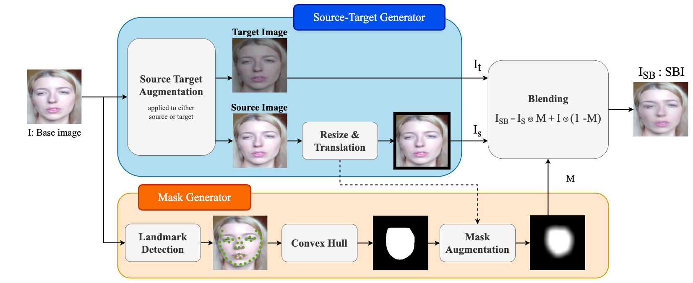

# Deepfake detection using Enhanced Self Blended Images using DWT features

Welcome! This research project is an extension of the following project: [Self Blended Images](https://github.com/mapooon/SelfBlendedImages/tree/master)
  

### Approach
 

This project aims to detect deepfakes using Self-Blended image (SBI) approach. The process for creating the self blended images is similar to the reference paper ([Self Blended Images](https://github.com/mapooon/SelfBlendedImages/tree/master)).

We enhance the SBI method using Discrete Wavelet Transform features. We apply the sym2 transform with reflect mode. DWT features emphasize the frequency features in the deepfakes. Frequency artifacts are common in deepfakes.
The approach is illustrated in the diagram above.

### Results
| Method | AUC (%) |
|--------|---------|
| MCX-API |  90.87 |
| FRDM |  79.40 |
| PCL + I2G |  90.03 |
| LRL |  78.26 |
| LipForensics |  82.40 |
| FTCN |  86.90 |
| EFNB4 + SBI (FF RAW) |  93.18 |
| EFNB4 + SBI (FF c23) |  92.93 |
| **EFNB5 + ESBI [ours]** | **95.49** |

